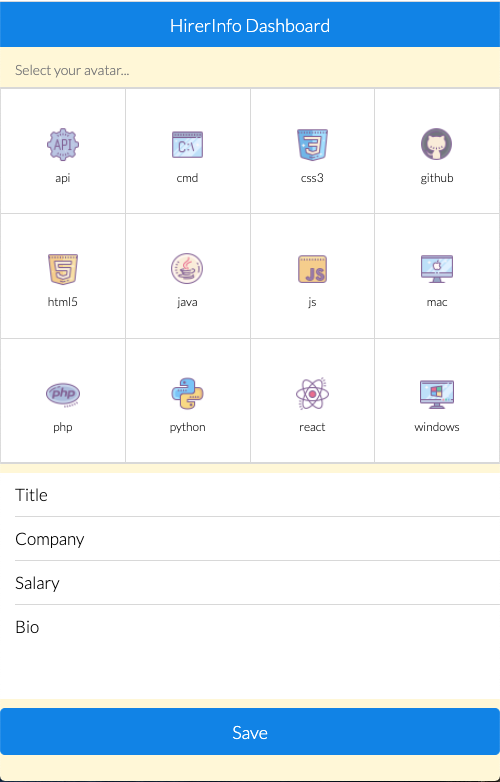
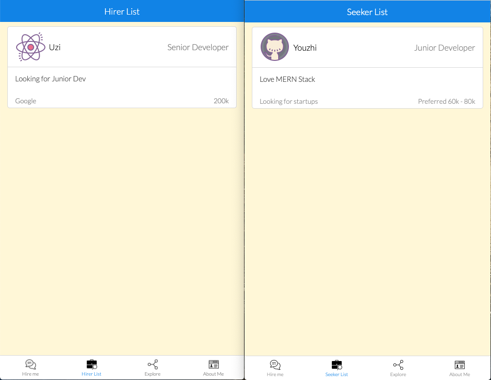
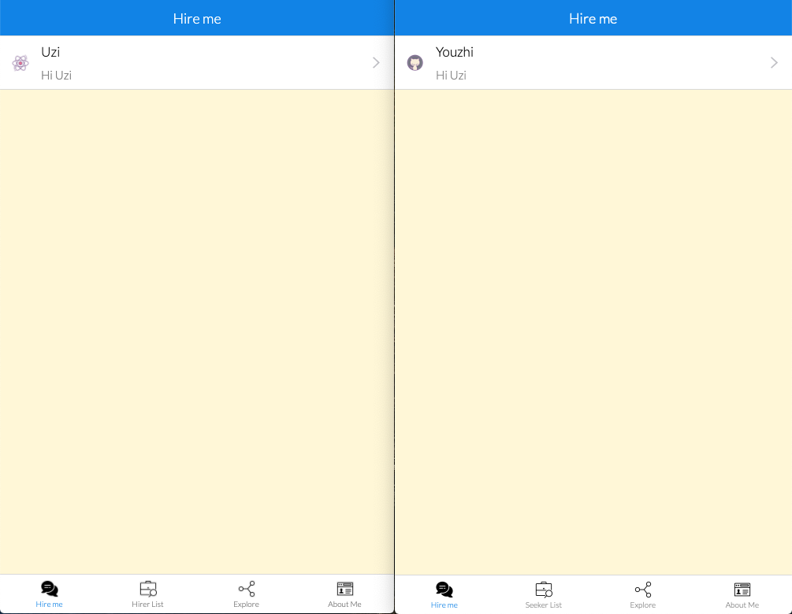
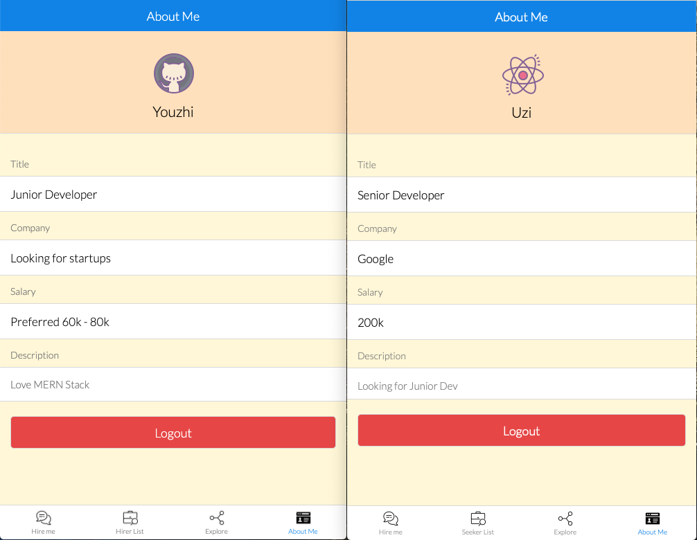

# Hire Me


How long have you been waiting for a response to a job application?

Do you think you are unemployed because of the lack of experience, or skills or both?

Do you think you are at a disadvantage position because of the COVID-19?

You are not alone...

Maybe instead of feeling depressed, you could try HireMe!

## Description


HireMe! is an app tailored to job seekers who are considering a career change in the face of adversity.

This app provides a place where people could share their experience, inspire others and help each other, especially for job seekers of 2020.

By using this app, you can be connected with and get help from more experienced job seeks or professionals by initiating a conversation.

What are you waiting for? Sign up today and profit!

## What is HireMe?

Essentially, it prepares you for technical interviews by learning from others.

It consists of three components:

- Instant Messaging for quick chat, small talk, even Q&A (Done! But still need to optimise)
- A Forum where one can share his/her experience i.e. technical interviews (Future Direction)
- Sample Questions Base (Future Direction)

## Table of Contents

- [Usage](#Usage)
- [License](#License)
- [Contributing](#Contributing)
- [Questions](#Questions)

## Usage

```
As a less experienced job seeker,
I want  talk to one of professionals and more experienced job seeker in real time for help
So that I can improve my skills and get myself prepared for the upcoming technical interviews
```

There are two types of users, one is job seeker and another one is job hirer. You need to choose avater and complete your account info if you want to be sucessfully registered.



After you successfully logged in or registered, this app will redirect you to this tab - either Hirer list or Seeker list, depending on which one you have selected.

This is a place where you can see other users, click their info card then you can talk to each other.

N.B: if you are a seeker, you will only see hirers in this tab, vice versa.



You can talk to each other in the real-time event.


All chat messages can be found on the Hire me tab.



Go to About me Tab if you want to see your info and Logout.



## Future Directions

Given that the number of registered users might increase in the future, search functionality will be built. users can search by name of users From either hirer list or seeker list tab.

Security issues also need to be addressed.

The LinkedIn API will be integrated into this app to help especially the aspect of Training Courses that are aligned to skills set.

This app will be deployed on Cloudflare Workers.

## License

This project is licensed under the MIT.

## Contributing

Willing to contribute to this project, fork this repo and send me a PR!

## Questions

If you have any questions about the repo, open an issue or contact me directly at jyzhu0101@gmail.com.

You can find more of my work at [Vulgarity2Elegance](https://github.com/Vulgarity2Elegance).
